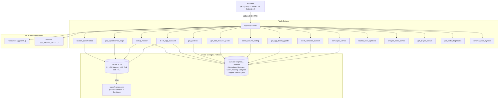

# cpp-mcp

[](https://github.com/CHOCEK-RB/cpp-mcp/actions/workflows/check.yml)
[](https://github.com/CHOCEK-RB/cpp-mcp/actions/workflows/test.yml)
[](https://github.com/CHOCEK-RB/cpp-mcp/actions/workflows/lint.yml)
[](https://www.npmjs.com/package/cpp-mcp)
[](LICENSE)
[](https://bun.sh)
[](https://modelcontextprotocol.io)

Model Context Protocol (MCP) server that empowers AI coding assistants with authoritative, real-time C and C++ documentation directly from [cppreference.com](https://cppreference.com).

---

## Architecture



---

## Features

- **Authoritative C/C++ Lookup**: Instant access to standard headers, containers, algorithms, keywords, and C++20/23/26 features.
- **Semantic Code Intelligence (xmake + clangd LSP)**: Deep AST understanding of your local codebase with automatic compilation database generation via `xmake`, symbol search, type inheritance, call hierarchies, and usage examples (`search_code_symbols`, `analyze_code_symbol`).
- **C++20/23/26 Modules Architecture**: Dedicated offline guide and best practices for `import std;`, interface & internal partitions, CMake 3.28+ (`FILE_SET CXX_MODULES`), and header migration (`get_cpp_modules_guide`).
- **Modern C/C++ Tooling Ecosystem**: In-depth recipes and starter configs for `xmake` (Lua build system with native C++20 modules), `clang-format`, `clang-tidy`, and runtime sanitizers (`get_cpp_tooling_guide`).
- **SEI CERT C++ Security Standard**: Complete catalog of 83 official rules with CWE mappings, heuristic auditing, and compliant fixes for memory safety, concurrency, strings, integers, and UB prevention (`check_secure_coding`).
- **C++ Core Guidelines Engine**: Offline catalog of 513 official rules with rationale, enforcement, and code examples (`get_guideline`).
- **Header & Version Resolution**: Offline static indexing for ISO C/C++ headers and SD-6 feature test macros (`lookup_header`, `check_cpp_standard`).
- **Tiered Cache with TTL**: Blazing-fast L1 memory LRU cache backed by persistent L2 disk cache (`~/.cache/cpp-mcp/`).
- **MCP Resources & Prompts**: Zero-token offline resources (`cppref://headers`, `cppref://modules`, `cppref://cert`, `cppref://tooling`, `cppref://guidelines`) and diagnostic prompt templates.
- **Standalone Binaries & Zero Setup**: Self-contained native single-file binaries (no Node or Bun required) or instant execution via `npx` / `bunx`.
- **Direct CLI Mode**: Run instant queries directly in your shell or build scripts (`xmake`, `Makefile`, `bash`) without an MCP client (e.g. `cpp-mcp header std::span`, `cpp-mcp demangle _Z3fooi`).
- **Noise Elimination**: Strips MediaWiki navigation menus, edit buttons, login prompts, and notices before LLM consumption.
- **Cursor Pagination**: Transparently handles oversized documentation pages in 16 KB chunks.

---

## Tools Catalog

### 1. `search_cppreference`

Searches cppreference.com for symbols, keywords, or headers and returns canonical documentation URLs.

- **Parameters**:
  - `query` (`string`, required): Search term (e.g. `"std::vector"`, `"constexpr"`, `"std::ranges::sort"`).

- **Output Example**:
  ```json
  {
    "query": "std::vector",
    "result_urls": [
      "https://cppreference.com/cpp/container/vector",
      "https://cppreference.com/cpp/experimental/execution_policy_tag_t"
    ]
  }
  ```

### 2. `get_cppreference_page`

Retrieves a documentation page, sanitizes the HTML, and returns LLM-ready Markdown.

- **Parameters**:
  - `url` (`string`, required): HTTPS URL from `cppreference.com` or `en.cppreference.com`.
  - `cursor` (`string`, optional): Pagination offset returned by a previous call (omit for first fragment).

- **Output Example**:
  ```json
  {
    "content": "# std::vector\n\n`std::vector` is a sequence container that encapsulates dynamic size arrays...",
    "next_cursor": "16384"
  }
  ```

### 3. `lookup_header`

Finds the canonical standard C or C++ header (`<vector>`, `<algorithm>`, `<cstdio>`, `<ranges>`, etc.) required for any function, type, class, or symbol, including standard version and category.

- **Parameters**:
  - `symbol` (`string`, required): C or C++ symbol, type, function, class, or header name (e.g. `"std::vector"`, `"printf"`, `"std::views::filter"`, `"<ranges>"`).

- **Output Example**:
  ```json
  {
    "query": "printf",
    "found": true,
    "header": "<cstdio>",
    "standard": "C++",
    "since": "C++98",
    "category": "C-style input/output",
    "cEquivalent": "<stdio.h>",
    "matchedSymbol": "printf",
    "source": "static_index"
  }
  ```

### 4. `check_cpp_standard`

Checks which C or C++ language standard version introduced, deprecated, or removed a given symbol, and evaluates compatibility against a target standard version (e.g. C++17, C++20, C++23).

- **Parameters**:
  - `symbol` (`string`, required): C or C++ symbol, type, function, class, or header name (e.g. `"std::span"`, `"std::auto_ptr"`, `"std::print"`).
  - `standard` (`string`, optional): Target language standard to evaluate compatibility against (e.g. `"c++17"`, `"c++20"`, `"c++23"`).

- **Output Example**:
  ```json
  {
    "symbol": "std::span",
    "standard": "C++",
    "since": "C++20",
    "targetStandard": "C++17",
    "status": "unsupported",
    "featureTestMacro": {
      "macro": "__cpp_lib_span",
      "value": "202002L"
    },
    "summary": "std::span is available since C++20. Target standard C++17: unsupported.",
    "source": "static_index"
  }
  ```

### 5. `get_guideline`

Looks up official rules, idioms, and best practices from the **C++ Core Guidelines** (Bjarne Stroustrup & Herb Sutter) by rule ID (e.g. `F.16`, `R.1`, `C.21`, `ES.20`, `I.11`) or topic query (e.g. `"RAII"`, `"rule of five"`, `"ownership"`).

- **Parameters**:
  - `rule_id` (`string`, optional): Exact or flexible rule ID (e.g. `"F.16"`, `"R.1"`, `"C.21"`, `"f16"`).
  - `query` (`string`, optional): Search topic or keyword (e.g. `"RAII"`, `"ownership"`, `"smart pointers"`).
  - `section` (`string`, optional): Section name filter (e.g. `"Resource management"`, `"Functions"`).
  - `include_content` (`boolean`, optional): Include complete markdown text with code examples.

- **Output Example**:
  ```json
  {
    "query": "R.1",
    "found": true,
    "totalMatches": 1,
    "rule": {
      "id": "R.1",
      "title": "Manage resources automatically using resource handles and RAII (Resource Acquisition Is Initialization)",
      "section": "R: Resource management",
      "url": "https://isocpp.github.io/CppCoreGuidelines/CppCoreGuidelines#rr-raii",
      "reason": "To avoid leaks and the complexity of manual resource management...",
      "content": "##### Reason\n\nTo avoid leaks and the complexity of manual resource management..."
    }
  }
  ```

### 6. `get_cpp_modules_guide`

Retrieves authoritative architectural guides, rules, code patterns, and best practices for **C++ Modules in C++20, C++23, and C++26**. Covers `import std;`, interface & implementation partitions, Global Module Fragment macro hygiene, CMake 3.28+ native setup, and header migration.

- **Parameters**:
  - `topic` (`string`, optional): Specific topic ID or alias (e.g. `"syntax-structure"`, `"import-std"`, `"partitions"`, `"global-module-fragment"`, `"linkage-and-visibility"`, `"cmake-build-systems"`, `"migration-strategies"`, `"pitfalls-anti-patterns"`, `"cpp26-evolution"`).
  - `standard` (`string`, optional): Target C++ language version filter (`"c++20"`, `"c++23"`, `"c++26"`).
  - `query` (`string`, optional): Keyword search across module rules and code patterns (e.g. `"ninja"`, `"private fragment"`, `"inline"`, `"macro"`).

- **Output Example**:
  ```json
  {
    "found": true,
    "topic": "import-std",
    "title": "Standard Library Modules: import std and import std.compat (C++23/C++26)",
    "standard": "C++23",
    "summary": "Importing the standard library via 'import std;' vs 'import std.compat;', performance gains, and compiler support.",
    "rules": [
      "Use 'import std;' in C++23+ for standard library symbols in the 'std' namespace.",
      "Use 'import std.compat;' only if you need C standard library functions in the global namespace (e.g. '::printf')."
    ],
    "content": "### What is import std; (C++23, P2465R3)..."
  }
  ```

### 7. `check_secure_coding`

Audits C++ code for security vulnerabilities, undefined behavior (UB), and safety violations against the official **SEI CERT C++ Coding Standard** and **MITRE CWEs**. Provides noncompliant code explanations, exploitability risks, and compliant modern fixes.

- **Parameters**:
  - `rule_id` (`string`, optional): Specific SEI CERT rule ID (e.g. `"MEM50-CPP"`, `"OOP50-CPP"`, `"CON53-CPP"`, `"mem50"`) or CWE ID (`"CWE-416"`, `"CWE-833"`).
  - `category` (`string`, optional): Category filter (`"MEM"`, `"CON"`, `"EXP"`, `"OOP"`, `"ERR"`, `"CTR"`, `"MSC"`, `"DCL"`).
  - `query` (`string`, optional): Vulnerability search keyword (e.g. `"use-after-free"`, `"deadlock"`, `"slicing"`, `"strict aliasing"`).
  - `code` (`string`, optional): C++ source code snippet to scan for heuristic security anti-patterns (e.g. `std::rand()`, catch-by-value, throw in destructor).

- **Output Example**:
  ```json
  {
    "found": true,
    "rule": {
      "id": "MEM50-CPP",
      "category": "MEM",
      "title": "Do not access freed memory",
      "severity": "High",
      "cwe": "CWE-416",
      "vulnerability": "Use-After-Free",
      "summary": "Dereferencing a pointer after the allocated storage has been deallocated leads to undefined behavior...",
      "noncompliantCode": "int* ptr = new int(42);\ndelete ptr;\nstd::cout << *ptr << '\\n';",
      "compliantSolution": "auto ptr = std::make_unique<int>(42);\nstd::cout << *ptr << '\\n';"
    }
  }
  ```

### 8. `get_cpp_tooling_guide`

Retrieves documentation, directives, CLI commands, and production starter configurations for modern C/C++ developer tools:

- **`xmake`**: Lua-based build utility with zero-configuration C++20/C++23 module scanning and integrated packages (`add_requires`).
- **`clang-format`**: Unified styling with pointer alignment, include sorting, and bracket placements.
- **`clang-tidy`**: Strict static analysis check profiles (`modernize-*`, `bugprone-*`, `cert-*`).
- **`sanitizers`**: Compiler instrumentation flags for AddressSanitizer (`ASan`), UndefinedBehaviorSanitizer (`UBSan`), and ThreadSanitizer (`TSan`).

- **Parameters**:
  - `tool` (`string`, optional): Tool ID or alias (`"xmake"`, `"clang-format"`, `"clang-tidy"`, `"sanitizers"`, `"format"`, `"tidy"`, `"asan"`).
  - `query` (`string`, optional): Search keyword across configuration directives and commands (e.g. `"compile_commands"`, `"add_requires"`, `"IndentWidth"`).
  - `generate_config` (`boolean`, optional): Returns the raw copy-pasteable production configuration file (e.g. `xmake.lua`, `.clang-format`, `.clang-tidy`).

- **Output Example**:
  ```json
  {
    "found": true,
    "tool": "xmake",
    "configFileName": "xmake.lua",
    "configContent": "-- xmake.lua\nadd_rules(\"mode.debug\", \"mode.release\")...",
    "keyDirectives": [
      {
        "name": "add_files(\"src/*.cppm\")",
        "description": "Registers C++ module interfaces; xmake automatically invokes compiler module scanning."
      }
    ]
  }
  ```

### 9. `check_compiler_support`

Evaluates minimum compiler versions (GCC, Clang, MSVC, Apple Clang) required for modern C++ language and standard library features across C++17, C++20, C++23, and C++26. Optionally evaluates whether a specific compiler and version is compatible.

- **Parameters**:
  - `feature` (`string`, optional): Feature name, library symbol, or keyword (e.g. `"std::print"`, `"std::expected"`, `"import std"`, `"std::generator"`, `"deducing this"`, `"reflection"`).
  - `standard` (`string`, optional): Filter features by C++ standard version (`"C++20"`, `"C++23"`, `"C++26"`, `"C++17"`).
  - `compiler` (`string`, optional): Target compiler family (`"gcc"`, `"clang"`, `"msvc"`, `"apple_clang"`).
  - `version` (`string` | `number`, optional): User's compiler version (e.g. `"13.2"`, `"16.0"`, `17`).

- **Output Example**:
  ```json
  {
    "found": true,
    "entry": {
      "id": "std-print",
      "name": "std::print & std::println",
      "standard": "C++23",
      "paper": "P2093R14",
      "macro": "__cpp_lib_print",
      "header": "<print>",
      "compilers": {
        "gcc": "13",
        "clang": "17",
        "msvc": "19.38",
        "apple_clang": "15.0"
      }
    },
    "compatibility": {
      "compiler": "gcc",
      "userVersion": "12.2",
      "minVersion": "13",
      "compatible": false,
      "message": "Incompatible: gcc 12.2 is older than the required 13."
    }
  }
  ```

### 10. `demangle_symbol`

Demangles C++ symbol identifiers (Itanium ABI used by GCC/Clang, or MSVC) into human-readable function signatures and qualified class methods. Also detects, extracts, and translates mangled symbols in full compiler, linker, or crash stack trace logs.

- **Parameters**:
  - `symbol` (`string`, required): Mangled identifier (e.g. `"_ZNSt6vectorIiSaIiEE9push_backERKi"`, `"_Z3addii"`, `"?func@@YAHXZ"`) or full error log containing mangled symbols.
  - `strip_params` (`boolean`, optional): When `true`, strips parameter signatures to return only the qualified name.

- **Output Example**:
  ```json
  {
    "original": "_ZNSt6vectorIiSaIiEE9push_backERKi",
    "demangled": "std::vector<int, std::allocator<int>>::push_back(int const&)",
    "abi": "itanium",
    "method": "cxxfilt",
    "isMangled": true
  }
  ```

### 11. `search_code_symbols`

Searches for C++ symbols (classes, structs, functions, methods, variables) across your project workspace using `clangd` Language Server Protocol (LSP) and `xmake`/`CMake` compilation database integration.

- **Parameters**:
  - `query` (`string`, required): Symbol name or partial query to search for (e.g. `"Calculator"`, `"Vec2"`, `"render"`).
  - `workspaceDir` (`string`, optional): Project root directory containing `xmake.lua`, `CMakeLists.txt`, or `compile_commands.json` (defaults to current working directory).
  - `files` (`string[]`, optional): Filter results to matching file names or relative paths.
  - `limit` (`number`, optional): Maximum number of symbols to return (default: `25`).

- **Output Example**:
  ```json
  {
    "found": true,
    "query": "Vec2",
    "workspaceDir": "/workspace/project",
    "totalMatches": 2,
    "symbols": [
      {
        "name": "Vec2",
        "kind": "struct",
        "file": "/workspace/project/include/vector_math.hpp",
        "line": 5,
        "character": 10
      }
    ]
  }
  ```

### 12. `analyze_code_symbol`

Performs deep multi-dimensional semantic analysis of a C++ symbol in your project: definition, declaration, hover signature, docstrings, inheritance hierarchy (base and derived classes), call hierarchy (incoming and outgoing calls), class/struct members, and live usage examples.

- **Parameters**:
  - `symbol` (`string`, required): Symbol name or qualified name to analyze (e.g. `"Calculator::add"`, `"Vec2"`, `"tb_hash_map_init"`).
  - `workspaceDir` (`string`, optional): Project root directory.
  - `file` (`string`, optional): Source file path hint for disambiguation.
  - `line` (`number`, optional): Line number hint (1-indexed) for disambiguation.
  - `maxExamples` (`number`, optional): Maximum usage references to extract (default: `5`).

- **Output Example**:
  ```json
  {
    "found": true,
    "symbol": "tb_hash_map_init",
    "kind": "function",
    "signature": "tb_hash_map_ref_t tb_hash_map_init(tb_size_t bucket_size, tb_element_t element_name, tb_element_t element_data)",
    "documentation": "init hash map\n@param bucket_size the hash bucket size...\n@return the hash map",
    "declaration": {
      "file": "/workspace/project/include/hash_map.h",
      "line": 107,
      "character": 25
    },
    "definition": {
      "file": "/workspace/project/include/hash_map.h",
      "line": 107,
      "character": 25
    },
    "callHierarchy": {
      "incomingCalls": [
        {
          "from": {
            "name": "tb_string_pool_init",
            "kind": "function",
            "file": "/workspace/project/src/string_pool.c",
            "line": 55
          },
          "callCount": 1
        }
      ],
      "outgoingCalls": []
    },
    "usageExamples": [
      {
        "file": "/workspace/project/src/string_pool.c",
        "line": 67,
        "preview": "pool->cache = tb_hash_map_init(0, tb_element_str(bcase), tb_element_size());"
      }
    ]
  }
  ```

### 13. `get_project_details`

Inspects C/C++ workspace build configuration, automatically detects build system (`xmake`, `CMake`, or pre-existing `compile_commands.json`), counts indexed translation units, and verifies host toolchain availability (`clangd`, `xmake`).

- **Parameters**:
  - `workspaceDir` (`string`, optional): Project root directory containing `xmake.lua`, `CMakeLists.txt`, or `compile_commands.json` (defaults to current working directory).
  - `autoGenerate` (`boolean`, optional): Automatically run `xmake project -k compile_commands` if `compile_commands.json` is missing (default: `true`).

- **Output Example**:
  ```json
  {
    "found": true,
    "buildSystem": "xmake",
    "rootDir": "/home/user/project",
    "compileCommandsPath": "/home/user/project/compile_commands.json",
    "entryCount": 378,
    "generated": true,
    "toolchain": {
      "clangd": true,
      "xmake": true
    }
  }
  ```

### 14. `get_code_diagnostics`

Retrieves live C/C++ compilation diagnostics (syntax errors, type mismatches, missing headers, unused variables, and compiler warnings) powered by `clangd` LSP and the project compilation database. Supports inspecting saved files or testing in-memory code snippets with multi-line caret pointers.

- **Parameters**:
  - `file` (`string`, optional): Source or header file to analyze (e.g. `"src/main.cpp"`). If omitted, returns diagnostics across all tracked project files.
  - `code` (`string`, optional): In-memory source code to check without modifying disk.
  - `workspaceDir` (`string`, optional): Project root directory.
  - `severity` (`string`, optional): Filter diagnostics (`"all"`, `"error"`, `"warning"`). Defaults to `"all"`.
  - `waitTimeout` (`number`, optional): Maximum seconds to wait for clangd AST parsing (default: `3`).

- **Output Example**:
  ```json
  {
    "success": true,
    "workspaceDir": "/home/user/project",
    "buildSystem": "xmake",
    "totalErrors": 1,
    "totalWarnings": 0,
    "files": [
      {
        "file": "src/main.cpp",
        "errorCount": 1,
        "warningCount": 0,
        "diagnostics": [
          {
            "file": "src/main.cpp",
            "line": 42,
            "character": 12,
            "endLine": 42,
            "endCharacter": 24,
            "severity": "error",
            "message": "use of undeclared identifier 'my_variable'",
            "source": "clang",
            "snippet": "  41 | int a = 10;\n> 42 | my_variable = 20;\n     | ^~~~~~~~~~~\n  43 | return a;"
          }
        ]
      }
    ]
  }
  ```

### 15. `rename_code_symbol`

Performs AST-level semantic symbol renaming across all workspace files powered by `clangd` LSP. Simultaneously updates declarations (`.hpp`), definitions (`.cpp`), and all call sites without text-replacement false positives. Includes collision detection and dry-run preview before touching files on disk.

- **Parameters**:
  - `symbol` (`string`, required): Symbol name or qualified identifier to rename (e.g. `"Calculator::add"`, `"calculate_total"`).
  - `new_name` (`string`, required): New identifier name (must be a valid C/C++ identifier).
  - `workspaceDir` (`string`, optional): Project root directory.
  - `file` (`string`, optional): Source or header file path hint for symbol location.
  - `line` (`number`, optional): Line number hint (1-indexed).
  - `dry_run` (`boolean`, optional): When `true` (default), returns preview diff without modifying disk. When `false`, writes changes to disk.

- **Output Example**:
  ```json
  {
    "success": true,
    "symbol": "calculate_total",
    "newName": "compute_total",
    "dryRun": true,
    "workspaceDir": "/home/user/project",
    "totalEdits": 3,
    "affectedFiles": [
      {
        "file": "include/math_utils.hpp",
        "editCount": 1,
        "edits": [
          {
            "line": 3,
            "character": 7,
            "endLine": 3,
            "endCharacter": 22,
            "oldText": "calculate_total",
            "newText": "compute_total",
            "snippet": "- 3 | int calculate_total(int a, int b);\n+ 3 | int compute_total(int a, int b);"
          }
        ]
      }
    ]
  }
  ```

---

## Resources Catalog

The server exposes read-only MCP resources providing zero-overhead offline datasets:

- **`cppref://headers`**: Complete inventory of all ISO C and C++ standard library headers with categories and declared symbols.
- **`cppref://headers/{name}`**: Detailed specification, declared symbols, and standard revisions for a specific header (e.g. `cppref://headers/vector`, `cppref://headers/ranges`, `cppref://headers/print`).
- **`cppref://standards`**: Chronological standards timeline (C++98 to C++26, C89 to C23) and official feature test macros.
- **`cppref://guidelines`**: Complete index of 513 official C++ Core Guidelines rules with identifiers, titles, and sections.
- **`cppref://guidelines/{id}`**: Full specification, rationale, enforcement, and code examples for a specific Core Guidelines rule.
- **`cppref://modules`**: Catalog of architectural guides and best practice rules for C++20, C++23, and C++26 Modules.
- **`cppref://modules/{topic}`**: Full architectural specification, code patterns, and rules for a specific module topic.
- **`cppref://cert`**: Complete catalog of 83 official SEI CERT C++ Coding Standard rules with categories, severity, priority, and CWE mappings.
- **`cppref://cert/{id}`**: Detailed SEI CERT rule specification with risk assessment, noncompliant code, and compliant solution.
- **`cppref://tooling`**: Catalog of modern C/C++ developer tools (`xmake`, `clang-format`, `clang-tidy`, runtime sanitizers).
- **`cppref://tooling/{tool}`**: In-depth documentation, CLI commands, and production starter configurations for a specific tool.
- **`cppref://compiler-support`**: Comprehensive compiler support matrix (GCC, Clang, MSVC, Apple Clang) for modern C++ features.
- **`cppref://compiler-support/{feature}`**: Detailed compiler support matrix, WG21 paper, and feature test macro for a specific feature.

---

## Prompts Catalog

Pre-engineered prompt templates for AI clients:

- **`cpp_explain_symbol`**: Structured explanation of a C/C++ symbol covering required header, language availability, time/space complexity, and idiomatic modern code example.
- **`cpp_modernize_code`**: Upgrades legacy C or C++ code into modern idiomatic C++ (C++20/C++23) using RAII, `std::ranges`, `std::string_view`, and `std::print`.
- **`cpp_diagnose_compiler_error`**: Diagnoses compiler diagnostic output, pinpointing missing `#include` headers, standard flag discrepancies (`-std=c++20`), or concept constraints.
- **`cpp_audit_guidelines`**: Conducts a thorough code review against the C++ Core Guidelines, highlighting rule violations (`R.1`, `F.16`, `C.21`) and recommending compliant modern solutions.
- **`cpp_modularize_code`**: Converts classic C++ headers and translation units into modern C++20/C++23/C++26 Modules with primary interface units, partitions, GMF macro isolation, and CMake 3.28+ build configuration.
- **`cpp_security_audit`**: Audits C++ code against the SEI CERT C++ Coding Standard and MITRE CWEs, identifying memory safety, concurrency races, and object lifetime violations with secure remediations.
- **`cpp_generate_tooling_config`**: Generates production-grade, authoritative configuration files for modern C/C++ developer tools (`xmake.lua`, `.clang-format`, `.clang-tidy`, sanitizer flags) tailored to project requirements.
- **`cpp_check_compiler_compatibility`**: Evaluates whether target C++ features will compile on specific compiler toolchain versions (GCC, Clang, MSVC, Apple Clang), proposing polyfills, fallback libraries, and feature test guards.

---

## Quickstart

### Option 1: Standalone Single-File Binary (Zero Dependencies)

Download the precompiled native executable for your platform from [GitHub Releases](https://github.com/CHOCEK-RB/cpp-mcp/releases):

```bash
# Linux x64
curl -L -o cpp-mcp https://github.com/CHOCEK-RB/cpp-mcp/releases/latest/download/cpp-mcp-linux-x64
chmod +x cpp-mcp
./cpp-mcp
```

Available binaries: `cpp-mcp-linux-x64`, `cpp-mcp-linux-arm64`, `cpp-mcp-darwin-x64`, `cpp-mcp-darwin-arm64`, `cpp-mcp-windows-x64.exe`.

### Option 2: Package Runners (Node.js / Bun)

```bash
# Using npx (Node.js)
npx -y cpp-mcp

# Using bunx (Bun)
bunx cpp-mcp
```

---

## Client Configuration

### Google Antigravity (AGY)

Add to global configuration (`~/.gemini/config/mcp_config.json`) or workspace configuration (`.agents/mcp_config.json`):

```json
{
  "mcpServers": {
    "cpp-mcp": {
      "command": "npx",
      "args": ["-y", "cpp-mcp"]
    }
  }
}
```

### Claude Desktop

Add this entry to your `claude_desktop_config.json`:

```json
{
  "mcpServers": {
    "cpp-mcp": {
      "command": "npx",
      "args": ["-y", "cpp-mcp"]
    }
  }
}
```

### Visual Studio Code (GitHub Copilot / Cline / Roo Code)

Add to your MCP configuration file (`mcp_settings.json` or Cline MCP settings):

```json
{
  "mcpServers": {
    "cpp-mcp": {
      "command": "npx",
      "args": ["-y", "cpp-mcp"],
      "disabled": false,
      "autoApprove": [
        "search_cppreference",
        "get_cppreference_page",
        "lookup_header",
        "check_cpp_standard"
      ]
    }
  }
}
```

### Zed

Add to your Zed `settings.json`:

```json
{
  "context_servers": {
    "cpp-mcp": {
      "command": {
        "path": "npx",
        "args": ["-y", "cpp-mcp"]
      }
    }
  }
}
```

### Standalone Native Executable (Zero Dependencies)

If you downloaded the precompiled binary from [GitHub Releases](https://github.com/CHOCEK-RB/cpp-mcp/releases), configure any client directly without Node.js or Bun:

```json
{
  "mcpServers": {
    "cpp-mcp": {
      "command": "/usr/local/bin/cpp-mcp-linux-x64"
    }
  }
}
```

---

## Direct CLI Usage (No MCP Client Required)

`cpp-mcp` doubles as a standalone command-line developer utility that integrates into terminals, CI/CD pipelines, and build scripts (`xmake`, `Makefile`, `bash`) without requiring an LLM or MCP client:

### 1. Workspace & Semantic Code Intelligence (xmake + clangd)

```bash
# Inspect project build configuration, compilation database, and host tools
cpp-mcp project
cpp-mcp project /path/to/project --json

# Search code symbols in your workspace (auto-detects xmake/CMake and spawns clangd)
cpp-mcp code-search Vec2
cpp-mcp code-search "tb_vector" --workspace /path/to/project

# Deep semantic analysis of a symbol (signature, doxygen, callers, struct fields, usage)
cpp-mcp code-analyze "tb_hash_map_init" --workspace /path/to/project
cpp-mcp code-analyze "Calculator::add"

# Disambiguate identical symbols or forward declarations via file and line hints
cpp-mcp code-analyze "__tb_element_t" --workspace /path/to/project --file include/element.h --line 182

# Check compiler errors and warnings with live AST diagnostics and caret pointers
cpp-mcp code-diagnostics
cpp-mcp code-diagnostics src/main.cpp
cpp-mcp code-diagnostics src/main.cpp --severity error
cpp-mcp code-diagnostics src/main.cpp --code "int x = undeclared_var;" --json

# Semantic symbol rename across project with preview (dry-run) or direct file modification
cpp-mcp code-rename "calculate_total" "compute_total"
cpp-mcp code-rename "calculate_total" "compute_total" --apply
cpp-mcp code-rename "Calculator::add" "sum" --workspace /path/to/project --json

# Raw or JSON output for shell scripting and automation
cpp-mcp code-search Vec2 --raw
cpp-mcp code-analyze "tb_hash_map_init" --json
```

### 2. Standard Reference, Tooling & Compiler Verification

```bash
# Fast header lookup (returns <span>)
cpp-mcp header std::span --raw

# Comprehensive symbol search across cppreference
cpp-mcp search "std::priority_queue"

# Demangle Itanium or MSVC symbols directly (or pipe logs via stdin)
cpp-mcp demangle "_Z3fooi"
cat build.log | cpp-mcp demangle -

# Check compiler support matrix (GCC, Clang, MSVC, Apple Clang)
cpp-mcp compiler std-print --compiler gcc --version 13.1

# Audit against SEI CERT C++ rules and CWE security vulnerabilities
cpp-mcp cert MEM50-CPP
cpp-mcp cert STR50-CPP --json

# Lookup C++ Core Guidelines rules, enforcement, and rationale
cpp-mcp guideline F.16
cpp-mcp guideline "RAII"

# Check standard availability and feature test macros
cpp-mcp standard std::span C++20

# Modern C++ tooling starter recipes (xmake, clang-format, clang-tidy)
cpp-mcp tooling xmake
```

---

## Semantic Architecture (xmake + clangd LSP)

The workspace semantic engine is built specifically for modern C/C++ workflows:

1. **Auto-Discovery**: Detects `xmake.lua`, `CMakeLists.txt`, or existing `compile_commands.json` in candidate directories (`.`, `build/`, `.vscode/`, `.xmake/`).
2. **xmake Generator**: If an `xmake` project lacks a compilation database, `cpp-mcp` automatically runs `xmake project -k compile_commands` to produce a pristine `compile_commands.json` in seconds.
3. **Lightweight Clangd Client**: Spawns `clangd` as a child process using raw JSON-RPC over `stdio` with standard `Content-Length` framing, without heavyweight LSP library overhead.
4. **Cold-Start Preloading**: Upon initialization, primary translation units from `compile_commands.json` are automatically preloaded (`textDocument/didOpen`), ensuring early symbol queries hit memory AST immediately instead of returning empty results.
5. **Robust Process Lifecycle**: Drains `stderr` continuously to avoid 64 KB kernel pipe deadlocks, pools concurrent initialization requests to prevent duplicate orphan processes, and binds termination handlers (`SIGINT`, `SIGTERM`, `exit`) to ensure zero zombie `clangd` instances.

---

## Development

```bash
# 1. Clone repository
git clone https://github.com/CHOCEK-RB/cpp-mcp.git
cd cpp-mcp

# 2. Install dependencies & initialize git hooks
bun install

# 3. Start development server in watch mode
bun run dev

# 4. Quality gates & build
bun run check        # TypeScript strict verification
bun run lint         # Biome formatting and lint check
bun run lint:fix     # Auto-fix formatting issues
bun test --coverage  # Run test suite with coverage
bun run build        # Compile self-contained bundle into dist/
bun run compile      # Build native standalone binary (dist/bin/cpp-mcp)
bun run compile:all  # Cross-compile native binaries for 5 platform targets
bun run check:publint# Validate package distribution standards
```

---

## Contributing

Contributions are welcome! Please review [CONTRIBUTING.md](CONTRIBUTING.md) for details on our workflow, Conventional Commits, and code standards.

---

## Security

Please report any security vulnerabilities following our responsible disclosure policy in [SECURITY.md](SECURITY.md).

---

## License

This project is licensed under the MIT License - see the [LICENSE](LICENSE) file for details.
