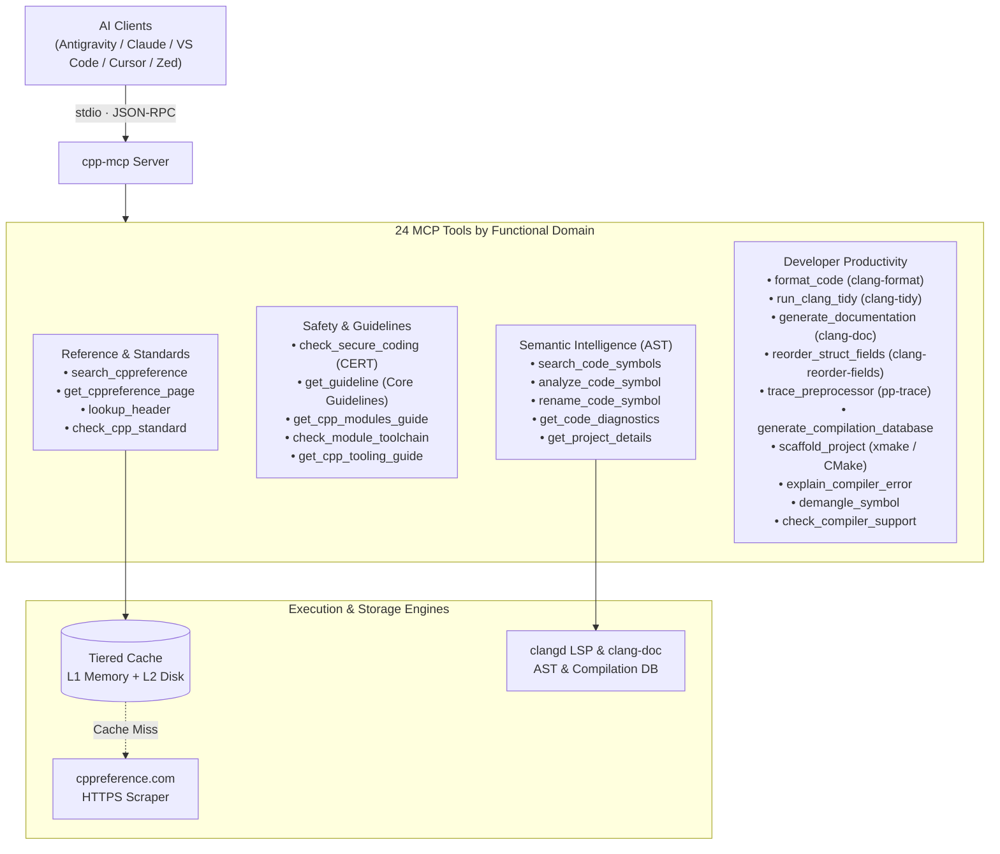

# cpp-mcp

[](https://github.com/CHOCEK-RB/cpp-mcp/actions/workflows/check.yml)
[](https://github.com/CHOCEK-RB/cpp-mcp/actions/workflows/test.yml)
[](https://github.com/CHOCEK-RB/cpp-mcp/actions/workflows/lint.yml)
[](https://www.npmjs.com/package/cpp-mcp)
[](LICENSE)
[](https://bun.sh)
[](https://modelcontextprotocol.io)

Model Context Protocol (MCP) server that empowers AI coding assistants with authoritative, real-time C and C++ documentation directly from [cppreference.com](https://cppreference.com).

---

## Architecture



---

## Features

- **Authoritative C/C++ Lookup**: Instant access to standard headers, containers, algorithms, keywords, and C++20/23/26 features.
- **Semantic Code Intelligence (xmake + clangd LSP)**: Deep AST understanding of your local codebase with automatic compilation database generation via `xmake`, symbol search, type inheritance, call hierarchies, and usage examples (`search_code_symbols`, `analyze_code_symbol`).
- **Live Compiler Diagnostics & AST Renaming**: Real-time error detection with caret pointers (`^~~~`), AST-based safe symbol renaming across all workspace files, and automated header tracking (`get_code_diagnostics`, `rename_code_symbol`).
- **C/C++ Code Formatter**: Instant in-memory and file formatting via `clang-format` with project `.clang-format` auto-discovery, standard presets (`LLVM`, `Google`), line ranges, and unified diff preview (`format_code`).
- **Host-Aware clang-tidy Linting**: Runs `clang-tidy` over project files with check presets (`modernize`, `bugprone`, `performance`, `portability`, `cppcoreguidelines`, `cert`, `security`, `all`), reports diagnostics with caret positions, and applies fixes in place only when explicitly requested (`run_clang_tidy`).
- **Host-Aware Module Toolchain Detection**: Inspects the host `clang++`, `g++`, `libc++` and `clangd` to state which `import std;` setup is viable, including the clangd vs GCC `.gcm` BMI mismatch (`check_module_toolchain`).
- **C/C++ Documentation Generator (clang-doc)**: Generates comprehensive API documentation from source code and Doxygen comments in Markdown, HTML, JSON, or YAML with compilation database integration and public API filtering (`generate_documentation`).
- **Semantic Field Reordering (clang-reorder-fields)**: Optimizes struct/class memory layout and padding while automatically rewriting member declarations, constructor initializer lists, aggregate initializers, and C++20 designated initializers across the entire codebase (`reorder_struct_fields`).
- **Preprocessor Tracer (pp-trace)**: Streams and aggregates the Clang preprocessor callback dump into a compact report of macro definitions, `#include` chains, `#if`/`#ifdef` branch decisions, pragmas, and C++20 module imports, filtered to project files by default (`trace_preprocessor`).
- **Independent Compilation Database Generator**: Automatically resolves, generates, or synthesizes `compile_commands.json` across CMake, xmake, Meson, Bear, or synthetic mode without a build system, unlocking clangd LSP and clang-doc (`generate_compilation_database`).
- **Smart C++ Project Scaffolding**: One-command project bootstrapping with modern `xmake` / `CMake`, C++11-26 standards, Catch2/GTest/doctest, C++20 modules, Qt6, CUDA, `.clang-format`, and `.clangd` LSP configurations (`scaffold_project`).
- **Intelligent Compiler & Linker Error Explainer**: Translates intimidating template cascades, unsatisfied C++20 concepts, missing vtables, and undefined references into plain English root causes, simplified signatures, and concrete code fixes (`explain_compiler_error`).
- **C++20/23/26 Modules Architecture**: Dedicated offline guide and best practices for `import std;`, interface & internal partitions, CMake 3.28+ (`FILE_SET CXX_MODULES`), and header migration (`get_cpp_modules_guide`).
- **Modern C/C++ Tooling Ecosystem**: In-depth recipes and starter configs for `xmake` (Lua build system with native C++20 modules), `clang-format`, `clang-tidy`, and runtime sanitizers (`get_cpp_tooling_guide`).
- **SEI CERT C++ Security Standard**: Complete catalog of 83 official rules with CWE mappings, heuristic auditing, and compliant fixes for memory safety, concurrency, strings, integers, and UB prevention (`check_secure_coding`).
- **C++ Core Guidelines Engine**: Offline catalog of 513 official rules with rationale, enforcement, and code examples (`get_guideline`).
- **Header & Version Resolution**: Offline static indexing for ISO C/C++ headers and SD-6 feature test macros (`lookup_header`, `check_cpp_standard`).
- **Tiered Cache with TTL**: Blazing-fast L1 memory LRU cache backed by persistent L2 disk cache (`~/.cache/cpp-mcp/`).
- **MCP Resources & Prompts**: Zero-token offline resources (`cppref://headers`, `cppref://modules`, `cppref://cert`, `cppref://tooling`, `cppref://guidelines`, `cppref://modernize/cheatsheet`) and diagnostic prompt templates.
- **Standalone Binaries & Zero Setup**: Self-contained native single-file binaries (no Node or Bun required) or instant execution via `npx` / `bunx`.
- **Direct CLI Mode**: Run instant queries directly in your shell or build scripts (`xmake`, `Makefile`, `bash`) without an MCP client (e.g. `cpp-mcp header std::span`, `cpp-mcp demangle _Z3fooi`).
- **Noise Elimination**: Strips MediaWiki navigation menus, edit buttons, login prompts, and notices before LLM consumption.
- **Cursor Pagination**: Transparently handles oversized documentation pages in 16 KB chunks.

---

## Tools Catalog

### 1. `search_cppreference`

Searches cppreference.com for symbols, keywords, or headers and returns canonical documentation URLs.

- **Parameters**:
  - `query` (`string`, required): Search term (e.g. `"std::vector"`, `"constexpr"`, `"std::ranges::sort"`).

- **Output Example**:
  ```json
  {
    "query": "std::vector",
    "result_urls": [
      "https://cppreference.com/cpp/container/vector",
      "https://cppreference.com/cpp/experimental/execution_policy_tag_t"
    ]
  }
  ```

### 2. `get_cppreference_page`

Retrieves a documentation page, sanitizes the HTML, and returns LLM-ready Markdown.

- **Parameters**:
  - `url` (`string`, required): HTTPS URL from `cppreference.com` or `en.cppreference.com`.
  - `cursor` (`string`, optional): Pagination offset returned by a previous call (omit for first fragment).

- **Output Example**:
  ```json
  {
    "content": "# std::vector\n\n`std::vector` is a sequence container that encapsulates dynamic size arrays...",
    "next_cursor": "16384"
  }
  ```

### 3. `lookup_header`

Finds the canonical standard C or C++ header (`<vector>`, `<algorithm>`, `<cstdio>`, `<ranges>`, etc.) required for any function, type, class, or symbol, including standard version and category.

- **Parameters**:
  - `symbol` (`string`, required): C or C++ symbol, type, function, class, or header name (e.g. `"std::vector"`, `"printf"`, `"std::views::filter"`, `"<ranges>"`).

- **Output Example**:
  ```json
  {
    "query": "printf",
    "found": true,
    "header": "<cstdio>",
    "standard": "C++",
    "since": "C++98",
    "category": "C-style input/output",
    "cEquivalent": "<stdio.h>",
    "matchedSymbol": "printf",
    "source": "static_index"
  }
  ```

### 4. `check_cpp_standard`

Checks which C or C++ language standard version introduced, deprecated, or removed a given symbol, and evaluates compatibility against a target standard version (e.g. C++17, C++20, C++23).

- **Parameters**:
  - `symbol` (`string`, required): C or C++ symbol, type, function, class, or header name (e.g. `"std::span"`, `"std::auto_ptr"`, `"std::print"`).
  - `standard` (`string`, optional): Target language standard to evaluate compatibility against (e.g. `"c++17"`, `"c++20"`, `"c++23"`).

- **Output Example**:
  ```json
  {
    "symbol": "std::span",
    "standard": "C++",
    "since": "C++20",
    "targetStandard": "C++17",
    "status": "unsupported",
    "featureTestMacro": {
      "macro": "__cpp_lib_span",
      "value": "202002L"
    },
    "summary": "std::span is available since C++20. Target standard C++17: unsupported.",
    "source": "static_index"
  }
  ```

### 5. `get_guideline`

Looks up official rules, idioms, and best practices from the **C++ Core Guidelines** (Bjarne Stroustrup & Herb Sutter) by rule ID (e.g. `F.16`, `R.1`, `C.21`, `ES.20`, `I.11`) or topic query (e.g. `"RAII"`, `"rule of five"`, `"ownership"`).

- **Parameters**:
  - `rule_id` (`string`, optional): Exact or flexible rule ID (e.g. `"F.16"`, `"R.1"`, `"C.21"`, `"f16"`).
  - `query` (`string`, optional): Search topic or keyword (e.g. `"RAII"`, `"ownership"`, `"smart pointers"`).
  - `section` (`string`, optional): Section name filter (e.g. `"Resource management"`, `"Functions"`).
  - `include_content` (`boolean`, optional): Include complete markdown text with code examples.

- **Output Example**:
  ```json
  {
    "query": "R.1",
    "found": true,
    "totalMatches": 1,
    "rule": {
      "id": "R.1",
      "title": "Manage resources automatically using resource handles and RAII (Resource Acquisition Is Initialization)",
      "section": "R: Resource management",
      "url": "https://isocpp.github.io/CppCoreGuidelines/CppCoreGuidelines#rr-raii",
      "reason": "To avoid leaks and the complexity of manual resource management...",
      "content": "##### Reason\n\nTo avoid leaks and the complexity of manual resource management..."
    }
  }
  ```

### 6. `get_cpp_modules_guide`

Retrieves authoritative architectural guides, rules, code patterns, and best practices for **C++ Modules in C++20, C++23, and C++26**. Covers `import std;`, interface & implementation partitions, Global Module Fragment macro hygiene, CMake 3.28+ native setup, and header migration.

- **Parameters**:
  - `topic` (`string`, optional): Specific topic ID or alias (e.g. `"syntax-structure"`, `"import-std"`, `"partitions"`, `"global-module-fragment"`, `"linkage-and-visibility"`, `"cmake-build-systems"`, `"migration-strategies"`, `"pitfalls-anti-patterns"`, `"cpp26-evolution"`).
  - `standard` (`string`, optional): Target C++ language version filter (`"c++20"`, `"c++23"`, `"c++26"`).
  - `query` (`string`, optional): Keyword search across module rules and code patterns (e.g. `"ninja"`, `"private fragment"`, `"inline"`, `"macro"`).

- **Output Example**:
  ```json
  {
    "found": true,
    "topic": "import-std",
    "title": "Standard Library Modules: import std and import std.compat (C++23/C++26)",
    "standard": "C++23",
    "summary": "Importing the standard library via 'import std;' vs 'import std.compat;', performance gains, and compiler support.",
    "rules": [
      "Use 'import std;' in C++23+ for standard library symbols in the 'std' namespace.",
      "Use 'import std.compat;' only if you need C standard library functions in the global namespace (e.g. '::printf')."
    ],
    "content": "### What is import std; (C++23, P2465R3)..."
  }
  ```

### 7. `check_secure_coding`

Audits C++ code for security vulnerabilities, undefined behavior (UB), and safety violations against the official **SEI CERT C++ Coding Standard** and **MITRE CWEs**. Provides noncompliant code explanations, exploitability risks, and compliant modern fixes.

- **Parameters**:
  - `rule_id` (`string`, optional): Specific SEI CERT rule ID (e.g. `"MEM50-CPP"`, `"OOP50-CPP"`, `"CON53-CPP"`, `"mem50"`) or CWE ID (`"CWE-416"`, `"CWE-833"`).
  - `category` (`string`, optional): Category filter (`"MEM"`, `"CON"`, `"EXP"`, `"OOP"`, `"ERR"`, `"CTR"`, `"MSC"`, `"DCL"`).
  - `query` (`string`, optional): Vulnerability search keyword (e.g. `"use-after-free"`, `"deadlock"`, `"slicing"`, `"strict aliasing"`).
  - `code` (`string`, optional): C++ source code snippet to scan for heuristic security anti-patterns (e.g. `std::rand()`, catch-by-value, throw in destructor).

- **Output Example**:
  ```json
  {
    "found": true,
    "rule": {
      "id": "MEM50-CPP",
      "category": "MEM",
      "title": "Do not access freed memory",
      "severity": "High",
      "cwe": "CWE-416",
      "vulnerability": "Use-After-Free",
      "summary": "Dereferencing a pointer after the allocated storage has been deallocated leads to undefined behavior...",
      "noncompliantCode": "int* ptr = new int(42);\ndelete ptr;\nstd::cout << *ptr << '\\n';",
      "compliantSolution": "auto ptr = std::make_unique<int>(42);\nstd::cout << *ptr << '\\n';"
    }
  }
  ```

### 8. `get_cpp_tooling_guide`

Retrieves documentation, directives, CLI commands, and production starter configurations for modern C/C++ developer tools, including **58 official recipes** synchronized from `xmake-io/xmake-skills`:

- **`xmake`**: Lua-based build utility with zero-configuration C++20/C++23 module scanning, integrated packages (`add_requires`), and 58 hands-on recipes across 12 categories (`toolchains`, `languages`, `packages`, `performance`, `testing`, etc.).
- **`clang-format`**: Unified styling with pointer alignment, include sorting, and bracket placements.
- **`clang-tidy`**: Strict static analysis check profiles (`modernize-*`, `bugprone-*`, `cert-*`).
- **`sanitizers`**: Compiler instrumentation flags for AddressSanitizer (`ASan`), UndefinedBehaviorSanitizer (`UBSan`), and ThreadSanitizer (`TSan`).

- **Parameters**:
  - `tool` (`string`, optional): Tool ID or alias (`"xmake"`, `"clang-format"`, `"clang-tidy"`, `"sanitizers"`, `"format"`, `"tidy"`, `"asan"`).
  - `topic` (`string`, optional): Specific tooling topic or official xmake recipe (e.g. `"cxx-modules"`, `"cross-compilation"`, `"packages"`, `"cuda"`, `"unity"`, `"zigcc"`).
  - `category` (`string`, optional): Filter xmake recipes by category (`"basics"`, `"cli"`, `"languages"`, `"packages"`, `"performance"`, `"project-config"`, `"toolchains"`, etc.).
  - `query` (`string`, optional): Search keyword across configuration directives, commands, and official recipes (e.g. `"compile_commands"`, `"add_requires"`, `"IndentWidth"`, `"cuda"`).
  - `generate_config` (`boolean`, optional): Returns the raw copy-pasteable production configuration file (e.g. `xmake.lua`, `.clang-format`, `.clang-tidy`).

- **Output Example**:
  ```json
  {
    "found": true,
    "tool": "xmake",
    "topic": "cxx-modules",
    "category": "toolchains",
    "title": "Building C++20 Modules with Xmake",
    "content": "# Building C++20 Modules with Xmake\n\nXmake has first-class C++20 modules support..."
  }
  ```

### 9. `check_compiler_support`

Evaluates minimum compiler versions (GCC, Clang, MSVC, Apple Clang) required for modern C++ language and standard library features across C++17, C++20, C++23, and C++26. Optionally evaluates whether a specific compiler and version is compatible.

- **Parameters**:
  - `feature` (`string`, optional): Feature name, library symbol, or keyword (e.g. `"std::print"`, `"std::expected"`, `"import std"`, `"std::generator"`, `"deducing this"`, `"reflection"`).
  - `standard` (`string`, optional): Filter features by C++ standard version (`"C++20"`, `"C++23"`, `"C++26"`, `"C++17"`).
  - `compiler` (`string`, optional): Target compiler family (`"gcc"`, `"clang"`, `"msvc"`, `"apple_clang"`).
  - `version` (`string` | `number`, optional): User's compiler version (e.g. `"13.2"`, `"16.0"`, `17`).

- **Output Example**:
  ```json
  {
    "found": true,
    "entry": {
      "id": "std-print",
      "name": "std::print & std::println",
      "standard": "C++23",
      "paper": "P2093R14",
      "macro": "__cpp_lib_print",
      "header": "<print>",
      "compilers": {
        "gcc": "13",
        "clang": "17",
        "msvc": "19.38",
        "apple_clang": "15.0"
      }
    },
    "compatibility": {
      "compiler": "gcc",
      "userVersion": "12.2",
      "minVersion": "13",
      "compatible": false,
      "message": "Incompatible: gcc 12.2 is older than the required 13."
    }
  }
  ```

### 10. `demangle_symbol`

Demangles C++ symbol identifiers (Itanium ABI used by GCC/Clang, or MSVC) into human-readable function signatures and qualified class methods. Also detects, extracts, and translates mangled symbols in full compiler, linker, or crash stack trace logs.

- **Parameters**:
  - `symbol` (`string`, required): Mangled identifier (e.g. `"_ZNSt6vectorIiSaIiEE9push_backERKi"`, `"_Z3addii"`, `"?func@@YAHXZ"`) or full error log containing mangled symbols.
  - `strip_params` (`boolean`, optional): When `true`, strips parameter signatures to return only the qualified name.

- **Output Example**:
  ```json
  {
    "original": "_ZNSt6vectorIiSaIiEE9push_backERKi",
    "demangled": "std::vector<int, std::allocator<int>>::push_back(int const&)",
    "abi": "itanium",
    "method": "cxxfilt",
    "isMangled": true
  }
  ```

### 11. `search_code_symbols`

Searches for C++ symbols (classes, structs, functions, methods, variables) across your project workspace using `clangd` Language Server Protocol (LSP) and `xmake`/`CMake` compilation database integration.

- **Parameters**:
  - `query` (`string`, required): Symbol name or partial query to search for (e.g. `"Calculator"`, `"Vec2"`, `"render"`).
  - `workspaceDir` (`string`, optional): Project root directory containing `xmake.lua`, `CMakeLists.txt`, or `compile_commands.json` (defaults to current working directory).
  - `files` (`string[]`, optional): Filter results to matching file names or relative paths.
  - `limit` (`number`, optional): Maximum number of symbols to return (default: `25`).

- **Output Example**:
  ```json
  {
    "found": true,
    "query": "Vec2",
    "workspaceDir": "/workspace/project",
    "totalMatches": 2,
    "symbols": [
      {
        "name": "Vec2",
        "kind": "struct",
        "file": "/workspace/project/include/vector_math.hpp",
        "line": 5,
        "character": 10
      }
    ]
  }
  ```

### 12. `analyze_code_symbol`

Performs deep multi-dimensional semantic analysis of a C++ symbol in your project: definition, declaration, hover signature, docstrings, inheritance hierarchy (base and derived classes), call hierarchy (incoming and outgoing calls), class/struct members, and live usage examples.

- **Parameters**:
  - `symbol` (`string`, required): Symbol name or qualified name to analyze (e.g. `"Calculator::add"`, `"Vec2"`, `"tb_hash_map_init"`).
  - `workspaceDir` (`string`, optional): Project root directory.
  - `file` (`string`, optional): Source file path hint for disambiguation.
  - `line` (`number`, optional): Line number hint (1-indexed) for disambiguation.
  - `maxExamples` (`number`, optional): Maximum usage references to extract (default: `5`).

- **Output Example**:
  ```json
  {
    "found": true,
    "symbol": "tb_hash_map_init",
    "kind": "function",
    "signature": "tb_hash_map_ref_t tb_hash_map_init(tb_size_t bucket_size, tb_element_t element_name, tb_element_t element_data)",
    "documentation": "init hash map\n@param bucket_size the hash bucket size...\n@return the hash map",
    "declaration": {
      "file": "/workspace/project/include/hash_map.h",
      "line": 107,
      "character": 25
    },
    "definition": {
      "file": "/workspace/project/include/hash_map.h",
      "line": 107,
      "character": 25
    },
    "callHierarchy": {
      "incomingCalls": [
        {
          "from": {
            "name": "tb_string_pool_init",
            "kind": "function",
            "file": "/workspace/project/src/string_pool.c",
            "line": 55
          },
          "callCount": 1
        }
      ],
      "outgoingCalls": []
    },
    "usageExamples": [
      {
        "file": "/workspace/project/src/string_pool.c",
        "line": 67,
        "preview": "pool->cache = tb_hash_map_init(0, tb_element_str(bcase), tb_element_size());"
      }
    ]
  }
  ```

### 13. `get_project_details`

Inspects C/C++ workspace build configuration, automatically detects build system (`xmake`, `CMake`, or pre-existing `compile_commands.json`), counts indexed translation units, and verifies host toolchain availability (`clangd`, `xmake`).

- **Parameters**:
  - `workspaceDir` (`string`, optional): Project root directory containing `xmake.lua`, `CMakeLists.txt`, or `compile_commands.json` (defaults to current working directory).
  - `autoGenerate` (`boolean`, optional): Automatically run `xmake project -k compile_commands` if `compile_commands.json` is missing (default: `true`).

- **Output Example**:
  ```json
  {
    "found": true,
    "buildSystem": "xmake",
    "rootDir": "/home/user/project",
    "compileCommandsPath": "/home/user/project/compile_commands.json",
    "entryCount": 378,
    "generated": true,
    "toolchain": {
      "clangd": true,
      "xmake": true
    }
  }
  ```

### 14. `get_code_diagnostics`

Retrieves live C/C++ compilation diagnostics (syntax errors, type mismatches, missing headers, unused variables, and compiler warnings) powered by `clangd` LSP and the project compilation database. Supports inspecting saved files or testing in-memory code snippets with multi-line caret pointers.

- **Parameters**:
  - `file` (`string`, optional): Source or header file to analyze (e.g. `"src/main.cpp"`). If omitted, returns diagnostics across all tracked project files.
  - `code` (`string`, optional): In-memory source code to check without modifying disk.
  - `workspaceDir` (`string`, optional): Project root directory.
  - `severity` (`string`, optional): Filter diagnostics (`"all"`, `"error"`, `"warning"`). Defaults to `"all"`.
  - `waitTimeout` (`number`, optional): Maximum seconds to wait for clangd AST parsing (default: `3`).

- **Output Example**:
  ```json
  {
    "success": true,
    "workspaceDir": "/home/user/project",
    "buildSystem": "xmake",
    "totalErrors": 1,
    "totalWarnings": 0,
    "files": [
      {
        "file": "src/main.cpp",
        "errorCount": 1,
        "warningCount": 0,
        "diagnostics": [
          {
            "file": "src/main.cpp",
            "line": 42,
            "character": 12,
            "endLine": 42,
            "endCharacter": 24,
            "severity": "error",
            "message": "use of undeclared identifier 'my_variable'",
            "source": "clang",
            "snippet": "  41 | int a = 10;\n> 42 | my_variable = 20;\n     | ^~~~~~~~~~~\n  43 | return a;"
          }
        ]
      }
    ]
  }
  ```

### 15. `rename_code_symbol`

Performs AST-level semantic symbol renaming across all workspace files powered by `clangd` LSP. Simultaneously updates declarations (`.hpp`), definitions (`.cpp`), and all call sites without text-replacement false positives. Includes collision detection and dry-run preview before touching files on disk.

- **Parameters**:
  - `symbol` (`string`, required): Symbol name or qualified identifier to rename (e.g. `"Calculator::add"`, `"calculate_total"`).
  - `new_name` (`string`, required): New identifier name (must be a valid C/C++ identifier).
  - `workspaceDir` (`string`, optional): Project root directory.
  - `file` (`string`, optional): Source or header file path hint for symbol location.
  - `line` (`number`, optional): Line number hint (1-indexed).
  - `dry_run` (`boolean`, optional): When `true` (default), returns preview diff without modifying disk. When `false`, writes changes to disk.

- **Output Example**:
  ```json
  {
    "success": true,
    "symbol": "calculate_total",
    "newName": "compute_total",
    "dryRun": true,
    "workspaceDir": "/home/user/project",
    "totalEdits": 3,
    "affectedFiles": [
      {
        "file": "include/math_utils.hpp",
        "editCount": 1,
        "edits": [
          {
            "line": 3,
            "character": 7,
            "endLine": 3,
            "endCharacter": 22,
            "oldText": "calculate_total",
            "newText": "compute_total",
            "snippet": "- 3 | int calculate_total(int a, int b);\n+ 3 | int compute_total(int a, int b);"
          }
        ]
      }
    ]
  }
  ```

### 16. `format_code`

Formats C/C++ source code snippets or files using `clang-format`. Ideal for formatting AI-generated code before writing to disk, ensuring strict compliance with the workspace `.clang-format` or standard presets (`LLVM`, `Google`, `Chromium`, `Mozilla`, `WebKit`, `Microsoft`).

- **Parameters**:
  - `code` (`string`, optional): In-memory C/C++ code snippet to format.
  - `file` (`string`, optional): Relative or absolute path to a file on disk.
  - `workspace` (`string`, optional): Workspace directory to look for `.clang-format`.
  - `style` (`string`, optional, default `"file"`): Format style preset or custom YAML string.
  - `fallback_style` (`string`, optional, default `"LLVM"`): Fallback preset if `.clang-format` is not found.
  - `apply` (`boolean`, optional, default `false`): If true, updates file on disk; otherwise outputs diff preview.
  - `start_line` / `end_line` (`number`, optional): 1-indexed line range to format only a sub-region.

- **Output Example**:
  ```json
  {
    "formatted": true,
    "changed": true,
    "formattedCode": "int main() {\n  int a = 1;\n  return a;\n}\n",
    "diff": "--- a/main.cpp\n+++ b/main.cpp\n@@ -1,1 +1,4 @@\n- int main(){int a=1;return a;}\n+ int main() {\n+   int a = 1;\n+   return a;\n+ }",
    "applied": false
  }
  ```

### 17. `scaffold_project`

Bootstraps a modern, production-ready C++ project configured with build systems (`xmake` or `CMake`), C++ standards (`11` through `26`), unit testing (`Catch2`, `GoogleTest`, `doctest`), package managers (`xrepo`, `vcpkg`, `conan`), and intelligent LSP configurations (`.clang-format`, `.clangd`).

- **Parameters**:
  - `project_name` (`string`, required): Project name (e.g. `"my_awesome_app"`).
  - `target_dir` (`string`, optional): Target directory for scaffolding (default: `./<project_name>`).
  - `build_system` (`string`, optional, default `"xmake"`): Build system (`"xmake"` or `"cmake"`).
  - `project_type` (`string`, optional, default `"executable"`): Type of project (`"executable"`, `"library"`, `"header-only"`, `"cxx-modules"`, `"qt"`, `"cuda"`).
  - `cpp_standard` (`string`, optional, default `"20"`): C++ standard (`"11"`, `"14"`, `"17"`, `"20"`, `"23"`, `"26"`).
  - `test_framework` (`string`, optional, default `"catch2"`): Test framework (`"catch2"`, `"gtest"`, `"doctest"`, `"none"`).
  - `package_manager` (`string`, optional): Package manager (`"xrepo"`, `"vcpkg"`, `"conan"`, `"none"`).
  - `init_clang_tools` (`boolean`, optional, default `true`): Generates `.clang-format` and `.clangd`.
  - `init_git` (`boolean`, optional, default `false`): Initializes local git repository.
  - `dry_run` (`boolean`, optional, default `false`): Previews generated file tree without writing to disk.
  - `overwrite` (`boolean`, optional, default `false`): Allows overwriting existing non-empty directory.

- **Output Example**:
  ```json
  {
    "success": true,
    "projectName": "my_app",
    "projectDir": "/home/user/my_app",
    "buildSystem": "xmake",
    "projectType": "executable",
    "cppStandard": "20",
    "testFramework": "catch2",
    "filesCreated": [
      "xmake.lua",
      ".clang-format",
      ".clangd",
      ".gitignore",
      "README.md",
      "include/my_app/my_app.hpp",
      "src/my_app.cpp",
      "src/main.cpp",
      "tests/test_main.cpp"
    ],
    "nextSteps": [
      "cd my_app",
      "xmake",
      "xmake run",
      "xmake test",
      "xmake project -k compile_commands"
    ]
  }
  ```

### 18. `explain_compiler_error`

Analyzes and explains complex, multi-page C++ compiler and linker errors in plain language. Demangles linker symbols, strips intimidating STL template expansion noise, pinpoints unsatisfied C++20 concepts, identifies missing vtables/destructors, and provides concrete remediation code.

- **Parameters**:
  - `error` (`string`, required): Compiler or linker error text (GCC, Clang, or MSVC).
  - `compiler` (`string`, optional, default `"auto"`): Compiler flavor hint (`"gcc"`, `"clang"`, `"msvc"`, or `"auto"`).
  - `code_snippet` (`string`, optional): Source code context around the failure point.
  - `workspace_dir` (`string`, optional): Project root directory.

- **Output Example**:
  ```json
  {
    "success": true,
    "category": "linker_undefined_reference",
    "detectedCompiler": "gcc",
    "summary": "Linker error: undefined reference to 'Calculator::add(int, int)'.",
    "rootCause": "The declaration for 'Calculator::add(int, int)' was visible during compilation, but its compiled object code was not found during linking.",
    "remediation": "1. Missing source file: Check if the .cpp containing 'Calculator::add' is included in your build.\n2. Template in .cpp: If 'add' is a template function, define it in the header.",
    "demangledSymbols": [
      {
        "mangled": "_ZN10Calculator3addEii",
        "demangled": "Calculator::add(int, int)"
      }
    ],
    "simplifiedError": "main.cpp:(.text+0x15): undefined reference to `Calculator::add(int, int)'"
  }
  ```

### 19. `generate_documentation`

Generates technical API documentation directly from C/C++ source code and Doxygen-style comments using LLVM `clang-doc`. Produces clean Markdown, standalone HTML sites, or structured JSON trees with inheritance, member types, function signatures, and return descriptions.

> **Non-destructive output:** files are generated in a temporary staging directory and then published to `output_dir`. Only files produced by clang-doc during a previous run, tracked in `<output_dir>/.cpp-mcp-docs.json`, are cleaned up, so hand-written documents that share the target extension are preserved. A failed clang-doc run leaves `output_dir` untouched.

- **Parameters**:
  - `workspace` (`string`, optional): Project workspace root containing `compile_commands.json`, `xmake.lua`, or `CMakeLists.txt`.
  - `files` (`string[]`, optional): Specific source or header files to document.
  - `output_dir` (`string`, optional, default `"docs/api"`): Output directory for generated documentation files.
  - `format` (`string`, optional, default `"md"`): Output format (`"md"`, `"html"`, `"json"`, or `"yaml"`).
  - `public_only` (`boolean`, optional, default `false`): Document only public declarations.
  - `doxygen_only` (`boolean`, optional, default `false`): Parse only Doxygen-style comments.
  - `dry_run` (`boolean`, optional, default `false`): Previews execution without writing files.

- **Output Example**:
  ```json
  {
    "success": true,
    "tool": "clang-doc (v22.1.8)",
    "version": "22.1.8",
    "format": "md",
    "outputDir": "/home/user/project/docs/api",
    "totalFiles": 4,
    "filesGenerated": [
      {
        "relativePath": "index.md",
        "absolutePath": "/home/user/project/docs/api/index.md",
        "sizeBytes": 128
      },
      {
        "relativePath": "geometry/Point.md",
        "absolutePath": "/home/user/project/docs/api/geometry/Point.md",
        "sizeBytes": 512
      }
    ],
    "summary": "Successfully generated 4 documentation file(s) in MD format into '/home/user/project/docs/api'.",
    "previewMarkdown": "# C/C++ Reference\n\n* Namespace: [geometry](geometry)\n..."
  }
  ```

### 20. `generate_compilation_database`

Generates, resolves, or synthesizes a `compile_commands.json` database for C/C++ projects. Supports CMake (`-DCMAKE_EXPORT_COMPILE_COMMANDS=ON`), xmake (`xmake project -k compile_commands`), Meson (`meson setup`), Bear (`bear -- make`), or synthetic filesystem scanning without a build system. Automatically unlocks clangd LSP and clang-doc for any repository.

- **Parameters**:
  - `workspace` (`string`, optional): Project workspace root containing build files or C/C++ source code.
  - `build_system` (`string`, optional, default `"auto"`): Generator mode: `"auto"`, `"cmake"`, `"xmake"`, `"meson"`, `"bear"`, or `"synthetic"`.
  - `build_dir` (`string`, optional, default `"build"`): Build output directory.
  - `compiler` (`string`, optional): Compiler executable for synthetic generation (e.g. `"clang++"`, `"g++"`).
  - `std` (`string`, optional, default `"c++20"`): C/C++ standard flag for synthetic generation.
  - `include_dirs` (`string[]`, optional): Additional include directories.
  - `symlink_to_root` (`boolean`, optional, default `true`): Links or copies the generated database to the workspace root.
  - `dry_run` (`boolean`, optional, default `false`): Previews generation without writing files.

- **Output Example**:
  ```json
  {
    "success": true,
    "buildSystem": "cmake",
    "compileCommandsPath": "/home/user/project/compile_commands.json",
    "entryCount": 12,
    "rootLinked": true,
    "filesIndexed": [
      "src/main.cpp",
      "src/math.cpp"
    ],
    "summary": "Successfully generated compile_commands.json via CMake (12 entries)."
  }
  ```

### 21. `reorder_struct_fields`

Reorders fields in C/C++ structs and classes using `clang-reorder-fields`. Optimizes memory layout and padding, and automatically synchronizes all field definitions, constructor initializer lists, aggregate initializers, and C++20 designated initializers across the codebase.

- **Parameters**:
  - `record_name` (`string`, required): Fully-qualified name of the struct or class (e.g. `"Foo"` or `"::bar::Foo"`).
  - `fields_order` (`string[]`, required): Desired order of field names (e.g. `["z", "w", "y", "x"]`).
  - `workspace` (`string`, optional): Workspace directory containing source files or `compile_commands.json`.
  - `files` (`string[]`, optional): Specific source or header files to inspect and update.
  - `extra_args` (`string[]`, optional): Additional compiler flags (e.g. `["-std=c++20"]`).
  - `apply` (`boolean`, optional, default `false`): When `true`, writes changes directly to disk. When `false` (default), returns preview diff.

- **Output Example**:
  ```json
  {
    "success": true,
    "recordName": "Data",
    "fieldsOrder": ["b", "a", "c"],
    "dryRun": true,
    "totalFiles": 2,
    "modifiedFiles": [
      "include/data.h",
      "src/main.c"
    ],
    "unifiedDiff": "--- a/include/data.h\n+++ b/include/data.h\n@@ -2,3 +2,3 @@\n+ double b;\n  char a;\n- double b;\n  int c;",
    "warnings": [],
    "summary": "[DRY-RUN / PREVIEW] Successfully reordered fields in 'Data' (b, a, c) across 2 file(s)."
  }
  ```

### 22. `run_clang_tidy`

Runs `clang-tidy` over one or more project files using check-group presets, resolves the compilation database automatically (xmake / CMake / existing `compile_commands.json`), and returns a structured diagnostic report. Reporting is the default; fixes are written to disk only when `apply` is set.

- **Parameters**:
  - `file` (`string`, optional): Single file to analyze.
  - `files` (`string[]`, optional): Multiple files to analyze (ignored when `file` is set).
  - `preset` (`string`, optional, default `modernize`): Check group — `modernize`, `bugprone`, `performance`, `portability`, `cppcoreguidelines`, `cert`, `security`, or `all`.
  - `checks` (`string`, optional): Raw `--checks` value; overrides `preset` (e.g. `-*,modernize-use-nullptr`).
  - `apply` (`boolean`, optional, default `false`): When `true`, apply fixes in place (`--fix --fix-errors --format-style=file`). Default is a non-destructive report.
  - `workspace` (`string`, optional): Workspace directory (defaults to cwd).
  - `build_dir` (`string`, optional): Directory containing `compile_commands.json`; auto-resolved when omitted.
  - `extra_args` (`string[]`, optional): Extra raw arguments appended to the `clang-tidy` invocation.

- **Output Example**:
  ```json
  {
    "success": true,
    "tool": "clang-tidy (v22.1.8)",
    "version": "22.1.8",
    "preset": "modernize",
    "checks": "modernize-*",
    "applied": false,
    "files": ["/home/user/project/src/main.cpp"],
    "totalWarnings": 1,
    "totalErrors": 0,
    "diagnostics": [
      {
        "file": "/home/user/project/src/main.cpp",
        "line": 12,
        "column": 13,
        "severity": "warning",
        "message": "use nullptr",
        "check": "modernize-use-nullptr"
      }
    ],
    "message": "1 finding(s) reported (dry-run). Re-run with apply=true to write fixes."
  }
  ```

### 23. `trace_preprocessor`

Traces the C/C++ preprocessor with `pp-trace` (clang-tools-extra) and returns a compact, filtered report instead of the raw multi-megabyte YAML callback dump. Summarizes macro definitions/undefinitions, `#include` directives, conditional compilation branch decisions (`#if`/`#ifdef`/`#elif`/`#else`), pragmas, and C++20 module imports. By default only events from project files are reported, keeping standard-library noise out.

- **Parameters**:
  - `file` (`string`, required): Source file to trace (absolute, or relative to `workspace`).
  - `workspace` (`string`, optional): Workspace directory used to locate `compile_commands.json` (passed to `pp-trace -p`).
  - `callbacks` (`string[]`, optional): Restrict tracing to specific callback names or globs (e.g. `["MacroDefined", "MacroExpands"]`).
  - `extra_args` (`string[]`, optional): Additional compiler flags (e.g. `["-std=c++20", "-Iinclude"]`).
  - `max_events` (`number`, optional, default `500`): Maximum number of raw events retained when `include_events` is enabled.
  - `include_events` (`boolean`, optional, default `false`): Include the capped raw callback event list in the output.
  - `user_files_only` (`boolean`, optional, default `true`): Report only events from project files, filtering out system headers and `<built-in>` locations.

- **Output Example**:
  ```json
  {
    "success": true,
    "source": "/home/user/project/src/main.cpp",
    "tool": { "name": "pp-trace", "path": "/usr/bin/pp-trace", "version": "22.1.8" },
    "summary": {
      "totalEvents": 309135,
      "userEvents": 6,
      "truncated": false,
      "counts": { "MacroDefined": 1, "MacroExpands": 1, "InclusionDirective": 1, "If": 1, "Endif": 1, "EndOfMainFile": 1 }
    },
    "macros": [{ "name": "MAX", "action": "define", "file": "/home/user/project/src/main.cpp", "loc": "/home/user/project/src/main.cpp:1:9" }],
    "includes": [{ "fileName": "vector", "angled": true, "searchPath": "/usr/include/c++/22" }],
    "conditionals": [{ "kind": "If", "loc": "/home/user/project/src/main.cpp:2:2", "conditionValue": false }],
    "pragmas": [],
    "modules": [],
    "warnings": []
  }
### 24. `check_module_toolchain`

Inspects the host toolchain (`clang++`, `g++`, a modularized `libc++`, and `clangd`) and reports which `import std;` setup is actually viable here, including the compiler-specific BMI formats that break clangd navigation.

- **Parameters**: none.
- **Output fields**: `host` (`clang`, `gcc` with `stdModule`, `clangd`, `libcxx`), `recommended` (`clang-libc++`, `gcc-native`, or `hybrid`), `options[]` (id, label, viable, reason, requirements), and `notes[]`.

- **Output Example**:
  ```json
  {
    "success": true,
    "host": {
      "clang": { "available": true, "version": "18.1.3" },
      "gcc": { "available": true, "version": "14.2.0", "stdModule": true },
      "clangd": { "available": true, "version": "18.1.3" },
      "libcxx": false
    },
    "recommended": "gcc-native",
    "notes": ["GCC can build `import std;` but clangd/clang cannot read GCC `.gcm` BMIs: expect `module_not_found` in the editor even when the build succeeds."]
  }
  ```

---

## Resources Catalog

The server exposes read-only MCP resources providing zero-overhead offline datasets:

- **`cppref://headers`**: Complete inventory of all ISO C and C++ standard library headers with categories and declared symbols.
- **`cppref://headers/{name}`**: Detailed specification, declared symbols, and standard revisions for a specific header (e.g. `cppref://headers/vector`, `cppref://headers/ranges`, `cppref://headers/print`).
- **`cppref://standards`**: Chronological standards timeline (C++98 to C++26, C89 to C23) and official feature test macros.
- **`cppref://guidelines`**: Complete index of 513 official C++ Core Guidelines rules with identifiers, titles, and sections.
- **`cppref://guidelines/{id}`**: Full specification, rationale, enforcement, and code examples for a specific Core Guidelines rule.
- **`cppref://modules`**: Catalog of architectural guides and best practice rules for C++20, C++23, and C++26 Modules.
- **`cppref://modules/{topic}`**: Full architectural specification, code patterns, and rules for a specific module topic.
- **`cppref://cert`**: Complete catalog of 83 official SEI CERT C++ Coding Standard rules with categories, severity, priority, and CWE mappings.
- **`cppref://cert/{id}`**: Detailed SEI CERT rule specification with risk assessment, noncompliant code, and compliant solution.
- **`cppref://tooling`**: Catalog of modern C/C++ developer tools (`xmake`, `clang-format`, `clang-tidy`, runtime sanitizers).
- **`cppref://tooling/{tool}`**: In-depth documentation, CLI commands, and production starter configurations for a specific tool.
- **`cppref://tooling/xmake/skills`**: Complete index of 58 official xmake recipes and agent skills across 12 categories.
- **`cppref://tooling/xmake/{topic}`**: Full recipe and tutorial markdown for a specific xmake capability (`cxx-modules`, `cross-compilation`, `packages`, etc.).
- **`cppref://compiler-support`**: Comprehensive compiler support matrix (GCC, Clang, MSVC, Apple Clang) for modern C++ features.
- **`cppref://compiler-support/{feature}`**: Detailed compiler support matrix, WG21 paper, and feature test macro for a specific feature.
- **`cppref://modernize/cheatsheet`**: Offline old-to-modern C++ idiom cheatsheet (`std::cout` → `std::print`, `printf` → `std::format`, `new`/`delete` → `make_unique`, `NULL` → `nullptr`, …) with the clang-tidy check that automates each rewrite.

---

## Prompts Catalog

Pre-engineered prompt templates for AI clients:

- **`cpp_explain_symbol`**: Structured explanation of a C/C++ symbol covering required header, language availability, time/space complexity, and idiomatic modern code example.
- **`cpp_modernize_code`**: Upgrades legacy C or C++ code into modern idiomatic C++ (C++20/C++23) using RAII, `std::ranges`, `std::string_view`, and `std::print`.
- **`cpp_diagnose_compiler_error`**: Diagnoses compiler diagnostic output, pinpointing missing `#include` headers, standard flag discrepancies (`-std=c++20`), or concept constraints.
- **`cpp_audit_guidelines`**: Conducts a thorough code review against the C++ Core Guidelines, highlighting rule violations (`R.1`, `F.16`, `C.21`) and recommending compliant modern solutions.
- **`cpp_modularize_code`**: Converts classic C++ headers and translation units into modern C++20/C++23/C++26 Modules with primary interface units, partitions, GMF macro isolation, and CMake 3.28+ build configuration.
- **`cpp_security_audit`**: Audits C++ code against the SEI CERT C++ Coding Standard and MITRE CWEs, identifying memory safety, concurrency races, and object lifetime violations with secure remediations.
- **`cpp_generate_tooling_config`**: Generates production-grade, authoritative configuration files for modern C/C++ developer tools (`xmake.lua`, `.clang-format`, `.clang-tidy`, sanitizer flags) tailored to project requirements.
- **`cpp_check_compiler_compatibility`**: Evaluates whether target C++ features will compile on specific compiler toolchain versions (GCC, Clang, MSVC, Apple Clang), proposing polyfills, fallback libraries, and feature test guards.

---

## Quickstart

### Option 1: Standalone Single-File Binary (Zero Dependencies)

Download the precompiled native executable for your platform from [GitHub Releases](https://github.com/CHOCEK-RB/cpp-mcp/releases):

```bash
# Linux x64
curl -L -o cpp-mcp https://github.com/CHOCEK-RB/cpp-mcp/releases/latest/download/cpp-mcp-linux-x64
chmod +x cpp-mcp
./cpp-mcp
```

Available binaries: `cpp-mcp-linux-x64`, `cpp-mcp-linux-arm64`, `cpp-mcp-darwin-x64`, `cpp-mcp-darwin-arm64`, `cpp-mcp-windows-x64.exe`.

### Option 2: Package Runners (Node.js / Bun)

```bash
# Using npx (Node.js)
npx -y cpp-mcp

# Using bunx (Bun)
bunx cpp-mcp
```

---

## Client Configuration

### Google Antigravity (AGY)

Add to global configuration (`~/.gemini/config/mcp_config.json`) or workspace configuration (`.agents/mcp_config.json`):

```json
{
  "mcpServers": {
    "cpp-mcp": {
      "command": "npx",
      "args": ["-y", "cpp-mcp"]
    }
  }
}
```

### Claude Desktop

Add this entry to your `claude_desktop_config.json`:

```json
{
  "mcpServers": {
    "cpp-mcp": {
      "command": "npx",
      "args": ["-y", "cpp-mcp"]
    }
  }
}
```

### Visual Studio Code (GitHub Copilot / Cline / Roo Code)

Add to your MCP configuration file (`mcp_settings.json` or Cline MCP settings):

```json
{
  "mcpServers": {
    "cpp-mcp": {
      "command": "npx",
      "args": ["-y", "cpp-mcp"],
      "disabled": false,
      "autoApprove": [
        "search_cppreference",
        "get_cppreference_page",
        "lookup_header",
        "check_cpp_standard"
      ]
    }
  }
}
```

### Zed

Add to your Zed `settings.json`:

```json
{
  "context_servers": {
    "cpp-mcp": {
      "command": {
        "path": "npx",
        "args": ["-y", "cpp-mcp"]
      }
    }
  }
}
```

### Standalone Native Executable (Zero Dependencies)

If you downloaded the precompiled binary from [GitHub Releases](https://github.com/CHOCEK-RB/cpp-mcp/releases), configure any client directly without Node.js or Bun:

```json
{
  "mcpServers": {
    "cpp-mcp": {
      "command": "/usr/local/bin/cpp-mcp-linux-x64"
    }
  }
}
```

---

## Direct CLI Usage (No MCP Client Required)

`cpp-mcp` doubles as a standalone command-line developer utility that integrates into terminals, CI/CD pipelines, and build scripts (`xmake`, `Makefile`, `bash`) without requiring an LLM or MCP client:

### 1. Workspace & Semantic Code Intelligence (xmake + clangd)

```bash
# Inspect project build configuration, compilation database, and host tools
cpp-mcp project
cpp-mcp project /path/to/project --json

# Generate compile_commands.json (CMake, xmake, Meson, Bear, or synthetic scan)
cpp-mcp compile-db
cpp-mcp compile-db /path/to/project --build-system cmake
cpp-mcp compile-db --build-system synthetic --std c++20

# Search code symbols in your workspace (auto-detects xmake/CMake and spawns clangd)
cpp-mcp code-search Vec2
cpp-mcp code-search "tb_vector" --workspace /path/to/project

# Deep semantic analysis of a symbol (signature, doxygen, callers, struct fields, usage)
cpp-mcp code-analyze "tb_hash_map_init" --workspace /path/to/project
cpp-mcp code-analyze "Calculator::add"

# Disambiguate identical symbols or forward declarations via file and line hints
cpp-mcp code-analyze "__tb_element_t" --workspace /path/to/project --file include/element.h --line 182

# Check compiler errors and warnings with live AST diagnostics and caret pointers
cpp-mcp code-diagnostics
cpp-mcp code-diagnostics src/main.cpp
cpp-mcp code-diagnostics src/main.cpp --severity error
cpp-mcp code-diagnostics src/main.cpp --code "int x = undeclared_var;" --json

# Semantic symbol rename across project with preview (dry-run) or direct file modification
cpp-mcp code-rename "calculate_total" "compute_total"
cpp-mcp code-rename "calculate_total" "compute_total" --apply
cpp-mcp code-rename "Calculator::add" "sum" --workspace /path/to/project --json

# Reorder struct/class fields to optimize memory layout & padding (clang-reorder-fields)
cpp-mcp reorder-fields "Foo" "z,w,y,x"
cpp-mcp reorder-fields "::bar::Foo" "z,w,y,x" --apply
cpp-mcp reorder-fields "Data" "b,a,c" --file src/data.h --apply

# Trace the preprocessor: macros, includes, and #if branches (pp-trace)
cpp-mcp trace-preprocessor src/main.cpp
cpp-mcp trace-preprocessor src/main.cpp --callbacks MacroDefined,MacroExpands --std c++20
cpp-mcp trace-preprocessor src/main.cpp --include-events --max-events 50 --json

# Raw or JSON output for shell scripting and automation
cpp-mcp code-search Vec2 --raw
cpp-mcp code-analyze "tb_hash_map_init" --json
```

### 2. Standard Reference, Tooling & Compiler Verification

```bash
# Fast header lookup (returns <span>)
cpp-mcp header std::span --raw

# Comprehensive symbol search across cppreference
cpp-mcp search "std::priority_queue"

# Demangle Itanium or MSVC symbols directly (or pipe logs via stdin)
cpp-mcp demangle "_Z3fooi"
cat build.log | cpp-mcp demangle -

# Check compiler support matrix (GCC, Clang, MSVC, Apple Clang)
cpp-mcp compiler std-print --compiler gcc --version 13.1

# Audit against SEI CERT C++ rules and CWE security vulnerabilities
cpp-mcp cert MEM50-CPP
cpp-mcp cert STR50-CPP --json

# Lookup C++ Core Guidelines rules, enforcement, and rationale
cpp-mcp guideline F.16
cpp-mcp guideline "RAII"

# Check standard availability and feature test macros
cpp-mcp standard std::span C++20

# Modern C++ tooling starter recipes & 58 official xmake skills
cpp-mcp tooling xmake
cpp-mcp tooling xmake cxx-modules
cpp-mcp tooling xmake toolchains

# Format in-memory snippet or source files via clang-format
cpp-mcp code-format --code "int main(){int a=1;return a;}"
cpp-mcp code-format src/main.cpp --apply

# Lint and modernize C/C++ files via clang-tidy (dry-run by default)
cpp-mcp clang-tidy src/main.cpp --preset modernize
cpp-mcp clang-tidy src/ --preset bugprone --check
cpp-mcp clang-tidy src/main.cpp --checks "-*,modernize-use-nullptr" --apply

# Scaffold a new modern C++ project (xmake/CMake, C++20/23, Catch2/GTest, .clangd)
cpp-mcp scaffold my_app
cpp-mcp scaffold my_lib --type library --std 23 --test gtest
cpp-mcp scaffold my_mod --type cxx-modules --std 20 --dry-run
cpp-mcp scaffold my_cmake_app --build cmake --test catch2

# Explain complex compiler errors, template explosions, or linker traces
cpp-mcp explain-error "main.cpp:8:5: error: 'vector' was not declared in this scope"
cat build.log | cpp-mcp explain-error -

# Generate API documentation via clang-doc (Markdown, HTML, JSON, YAML)
cpp-mcp docs --format md --output docs/api
cpp-mcp docs include/geometry.hpp --public
cpp-mcp docs --dry-run --json
```

### Command Reference & Aliases

Run `cpp-mcp <command>` for any of: `header`, `query`, `search`, `standard`, `guideline`, `cert`, `module`, `module-toolchain`, `tooling`, `compiler`, `demangle`, `project`, `code-search`, `code-analyze`, `code-diagnostics`, `code-rename`, `code-format`, `clang-tidy`, `scaffold`, `explain-error`, `docs`, `compile-db`, `reorder-fields`, `trace-preprocessor`.

`query` looks up the ISO header for a symbol and falls back to a cppreference search when the symbol is unknown. Several commands accept short aliases: `code-diagnostics` (`diagnostics`, `check`), `code-rename` (`rename`), `code-format` (`format`), `clang-tidy` (`tidy`, `modernize`), `module-toolchain` (`module-check`), `scaffold` (`init`), `explain-error` (`explain`), `docs` (`generate-docs`, `clang-doc`), `compile-db` (`compiledb`, `generate-compile-commands`), `reorder-fields` (`reorder`), and `trace-preprocessor` (`trace-pp`, `pretrace`).

---

## Semantic Architecture (xmake + clangd LSP)

The workspace semantic engine is built specifically for modern C/C++ workflows:

1. **Auto-Discovery**: Detects `xmake.lua`, `CMakeLists.txt`, or existing `compile_commands.json` in candidate directories (`.`, `build/`, `.vscode/`, `.xmake/`).
2. **xmake Generator**: If an `xmake` project lacks a compilation database, `cpp-mcp` automatically runs `xmake project -k compile_commands` to produce a pristine `compile_commands.json` in seconds.
3. **Lightweight Clangd Client**: Spawns `clangd` as a child process using raw JSON-RPC over `stdio` with standard `Content-Length` framing, without heavyweight LSP library overhead.
4. **Cold-Start Preloading**: Upon initialization, primary translation units from `compile_commands.json` are automatically preloaded (`textDocument/didOpen`), ensuring early symbol queries hit memory AST immediately instead of returning empty results.
5. **Robust Process Lifecycle**: Drains `stderr` continuously to avoid 64 KB kernel pipe deadlocks, pools concurrent initialization requests to prevent duplicate orphan processes, and binds termination handlers (`SIGINT`, `SIGTERM`, `exit`) to ensure zero zombie `clangd` instances.

---

## Environment Variables

| Variable | Description |
|---|---|
| `CPP_MCP_CACHE_DISABLE` | Set to `true` or `1` to disable the L2 on-disk cache (memory-only). |
| `CPP_MCP_CACHE_DIR` | Overrides the base cache directory (default `~/.cache/cpp-mcp/`). |
| `XDG_CACHE_HOME` | Used to derive the cache directory when `CPP_MCP_CACHE_DIR` is unset. |
| `CLANGD_PATH` | Overrides the `clangd` executable used by the semantic tools. |
| `CLANGD_QUERY_DRIVER` | Compiler driver(s) clangd may query for builtin system includes (gcc, cross-toolchains). Comma- or whitespace-separated; passed as `--query-driver`. |
| `CLANG_FORMAT_PATH` | Overrides the `clang-format` executable used by `format_code` / `cpp-mcp code-format`. |
| `CLANG_TIDY_PATH` | Overrides the `clang-tidy` executable used by `run_clang_tidy` / `cpp-mcp clang-tidy`. |

## Project Policy (`.cpp-mcp.json`)

Drop a `.cpp-mcp.json` at your project root (discovered upward from the working directory) to set project-wide defaults. Precedence for every value is **explicit flag > `CPP_MCP_STD` > policy file > built-in default**.

```json
{
  "std": "c++23",
  "clangTidy": { "preset": "bugprone", "checks": "bugprone-*" },
  "modernize": { "prefer": ["std::print", "std::format"] }
}
```

- `std` — default C++ standard for `scaffold_project` when `--std` is not passed.
- `clangTidy.preset` / `clangTidy.checks` — defaults for `run_clang_tidy` / `cpp-mcp clang-tidy` when `--preset`/`--checks` are omitted.
- `modernize.prefer` — advisory list of preferred modern replacements.

Unknown or malformed fields are ignored; a broken file never fails a command.

Use it as a CI gate with the `--check` flag, which exits non-zero when any finding is reported:

```bash
cpp-mcp clang-tidy src/ --check
```

---

## Development

```bash
# 1. Clone repository
git clone https://github.com/CHOCEK-RB/cpp-mcp.git
cd cpp-mcp

# 2. Install dependencies & initialize git hooks
bun install

# 3. Start development server in watch mode
bun run dev

# 4. Quality gates & build
bun run check        # TypeScript strict verification
bun run lint         # Biome formatting and lint check
bun run lint:fix     # Auto-fix formatting issues
bun test --coverage  # Run test suite with coverage
bun run build        # Compile self-contained bundle into dist/
bun run compile      # Build native standalone binary (dist/bin/cpp-mcp)
bun run compile:all  # Cross-compile native binaries for 5 platform targets
bun run check:publint # Validate package distribution standards
```

---

## Contributing

Contributions are welcome! Please review [CONTRIBUTING.md](CONTRIBUTING.md) for details on our workflow, Conventional Commits, and code standards.

---

## Security

Please report any security vulnerabilities following our responsible disclosure policy in [SECURITY.md](SECURITY.md).

---

## License

This project is licensed under the MIT License - see the [LICENSE](LICENSE) file for details.
