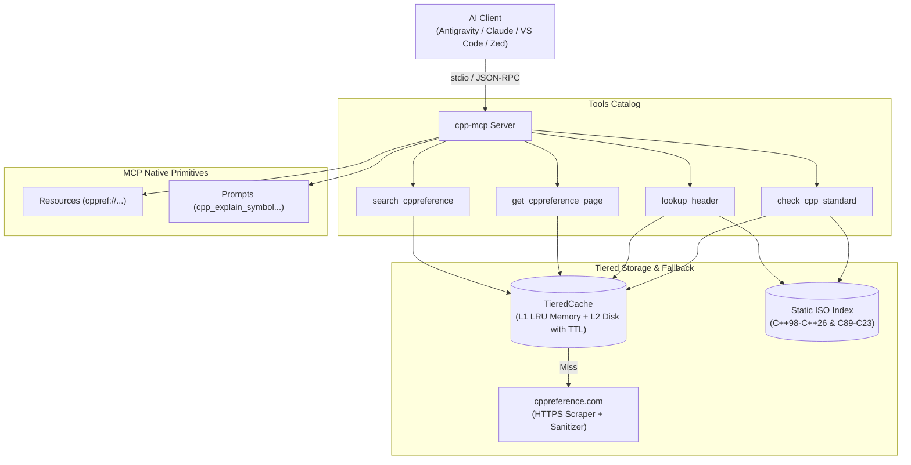

# cpp-mcp

[](https://github.com/CHOCEK-RB/cpp-mcp/actions/workflows/check.yml)
[](https://github.com/CHOCEK-RB/cpp-mcp/actions/workflows/test.yml)
[](https://github.com/CHOCEK-RB/cpp-mcp/actions/workflows/lint.yml)
[](https://www.npmjs.com/package/cpp-mcp)
[](LICENSE)
[](https://bun.sh)
[](https://modelcontextprotocol.io)

Model Context Protocol (MCP) server that empowers AI coding assistants with authoritative, real-time C and C++ documentation directly from [cppreference.com](https://cppreference.com).

---

## Architecture



---

## Features

- **Authoritative C/C++ Lookup**: Instant access to standard headers, containers, algorithms, keywords, and C++20/23/26 features.
- **Header & Version Resolution**: Offline static indexing for ISO C/C++ headers and SD-6 feature test macros (`lookup_header`, `check_cpp_standard`).
- **Tiered Cache with TTL**: Blazing-fast L1 memory LRU cache backed by persistent L2 disk cache (`~/.cache/cpp-mcp/`).
- **MCP Resources & Prompts**: Zero-token offline resources (`cppref://headers`, `cppref://standards`) and pre-engineered diagnostic prompt templates.
- **Standalone Binaries & Zero Setup**: Self-contained native single-file binaries (no Node or Bun required) or instant execution via `npx` / `bunx`.
- **Noise Elimination**: Strips MediaWiki navigation menus, edit buttons, login prompts, and notices before LLM consumption.
- **Cursor Pagination**: Transparently handles oversized documentation pages in 16 KB chunks.

---

## Tools Catalog

### 1. `search_cppreference`

Searches cppreference.com for symbols, keywords, or headers and returns canonical documentation URLs.

- **Parameters**:
  - `query` (`string`, required): Search term (e.g. `"std::vector"`, `"constexpr"`, `"std::ranges::sort"`).

- **Output Example**:
  ```json
  {
    "query": "std::vector",
    "result_urls": [
      "https://cppreference.com/cpp/container/vector",
      "https://cppreference.com/cpp/experimental/execution_policy_tag_t"
    ]
  }
  ```

### 2. `get_cppreference_page`

Retrieves a documentation page, sanitizes the HTML, and returns LLM-ready Markdown.

- **Parameters**:
  - `url` (`string`, required): HTTPS URL from `cppreference.com` or `en.cppreference.com`.
  - `cursor` (`string`, optional): Pagination offset returned by a previous call (omit for first fragment).

- **Output Example**:
  ```json
  {
    "content": "# std::vector\n\n`std::vector` is a sequence container that encapsulates dynamic size arrays...",
    "next_cursor": "16384"
  }
  ```

### 3. `lookup_header`

Finds the canonical standard C or C++ header (`<vector>`, `<algorithm>`, `<cstdio>`, `<ranges>`, etc.) required for any function, type, class, or symbol, including standard version and category.

- **Parameters**:
  - `symbol` (`string`, required): C or C++ symbol, type, function, class, or header name (e.g. `"std::vector"`, `"printf"`, `"std::views::filter"`, `"<ranges>"`).

- **Output Example**:
  ```json
  {
    "query": "printf",
    "found": true,
    "header": "<cstdio>",
    "standard": "C++",
    "since": "C++98",
    "category": "C-style input/output",
    "cEquivalent": "<stdio.h>",
    "matchedSymbol": "printf",
    "source": "static_index"
  }
  ```

### 4. `check_cpp_standard`

Checks which C or C++ language standard version introduced, deprecated, or removed a given symbol, and evaluates compatibility against a target standard version (e.g. C++17, C++20, C++23).

- **Parameters**:
  - `symbol` (`string`, required): C or C++ symbol, type, function, class, or header name (e.g. `"std::span"`, `"std::auto_ptr"`, `"std::print"`).
  - `standard` (`string`, optional): Target language standard to evaluate compatibility against (e.g. `"c++17"`, `"c++20"`, `"c++23"`).

- **Output Example**:
  ```json
  {
    "symbol": "std::span",
    "standard": "C++",
    "since": "C++20",
    "targetStandard": "C++17",
    "status": "unsupported",
    "featureTestMacro": {
      "macro": "__cpp_lib_span",
      "value": "202002L"
    },
    "summary": "std::span is available since C++20. Target standard C++17: unsupported.",
    "source": "static_index"
  }
  ```

---

## Resources Catalog

The server exposes read-only MCP resources providing zero-overhead offline datasets:

- **`cppref://headers`**: Complete inventory of all ISO C and C++ standard library headers with categories and declared symbols.
- **`cppref://headers/{name}`**: Detailed specification, declared symbols, and standard revisions for a specific header (e.g. `cppref://headers/vector`, `cppref://headers/ranges`, `cppref://headers/print`).
- **`cppref://standards`**: Chronological standards timeline (C++98 to C++26, C89 to C23) and official feature test macros.

---

## Prompts Catalog

Pre-engineered prompt templates for AI clients:

- **`cpp_explain_symbol`**: Structured explanation of a C/C++ symbol covering required header, language availability, time/space complexity, and idiomatic modern code example.
- **`cpp_modernize_code`**: Upgrades legacy C or C++ code into modern idiomatic C++ (C++20/C++23) using RAII, `std::ranges`, `std::string_view`, and `std::print`.
- **`cpp_diagnose_compiler_error`**: Diagnoses compiler diagnostic output, pinpointing missing `#include` headers, standard flag discrepancies (`-std=c++20`), or concept constraints.

---

## Quickstart

### Option 1: Standalone Single-File Binary (Zero Dependencies)

Download the precompiled native executable for your platform from [GitHub Releases](https://github.com/CHOCEK-RB/cpp-mcp/releases):

```bash
# Linux x64
curl -L -o cpp-mcp https://github.com/CHOCEK-RB/cpp-mcp/releases/latest/download/cpp-mcp-linux-x64
chmod +x cpp-mcp
./cpp-mcp
```

Available binaries: `cpp-mcp-linux-x64`, `cpp-mcp-linux-arm64`, `cpp-mcp-darwin-x64`, `cpp-mcp-darwin-arm64`, `cpp-mcp-windows-x64.exe`.

### Option 2: Package Runners (Node.js / Bun)

```bash
# Using npx (Node.js)
npx -y cpp-mcp

# Using bunx (Bun)
bunx cpp-mcp
```

---

## Client Configuration

### Google Antigravity (AGY)

Add to global configuration (`~/.gemini/config/mcp_config.json`) or workspace configuration (`.agents/mcp_config.json`):

```json
{
  "mcpServers": {
    "cpp-mcp": {
      "command": "npx",
      "args": ["-y", "cpp-mcp"]
    }
  }
}
```

### Claude Desktop

Add this entry to your `claude_desktop_config.json`:

```json
{
  "mcpServers": {
    "cpp-mcp": {
      "command": "npx",
      "args": ["-y", "cpp-mcp"]
    }
  }
}
```

### Visual Studio Code (GitHub Copilot / Cline / Roo Code)

Add to your MCP configuration file (`mcp_settings.json` or Cline MCP settings):

```json
{
  "mcpServers": {
    "cpp-mcp": {
      "command": "npx",
      "args": ["-y", "cpp-mcp"],
      "disabled": false,
      "autoApprove": [
        "search_cppreference",
        "get_cppreference_page",
        "lookup_header",
        "check_cpp_standard"
      ]
    }
  }
}
```

### Zed

Add to your Zed `settings.json`:

```json
{
  "context_servers": {
    "cpp-mcp": {
      "command": {
        "path": "npx",
        "args": ["-y", "cpp-mcp"]
      }
    }
  }
}
```

### Standalone Native Executable (Zero Dependencies)

If you downloaded the precompiled binary from [GitHub Releases](https://github.com/CHOCEK-RB/cpp-mcp/releases), configure any client directly without Node.js or Bun:

```json
{
  "mcpServers": {
    "cpp-mcp": {
      "command": "/usr/local/bin/cpp-mcp-linux-x64"
    }
  }
}
```

---

## Development

```bash
# 1. Clone repository
git clone https://github.com/CHOCEK-RB/cpp-mcp.git
cd cpp-mcp

# 2. Install dependencies & initialize git hooks
bun install

# 3. Start development server in watch mode
bun run dev

# 4. Quality gates & build
bun run check        # TypeScript strict verification
bun run lint         # Biome formatting and lint check
bun run lint:fix     # Auto-fix formatting issues
bun test --coverage  # Run test suite with coverage
bun run build        # Compile self-contained bundle into dist/
bun run compile      # Build native standalone binary (dist/bin/cpp-mcp)
bun run compile:all  # Cross-compile native binaries for 5 platform targets
bun run check:publint# Validate package distribution standards
```

---

## Contributing

Contributions are welcome! Please review [CONTRIBUTING.md](CONTRIBUTING.md) for details on our workflow, Conventional Commits, and code standards.

---

## Security

Please report any security vulnerabilities following our responsible disclosure policy in [SECURITY.md](SECURITY.md).

---

## License

This project is licensed under the MIT License - see the [LICENSE](LICENSE) file for details.
